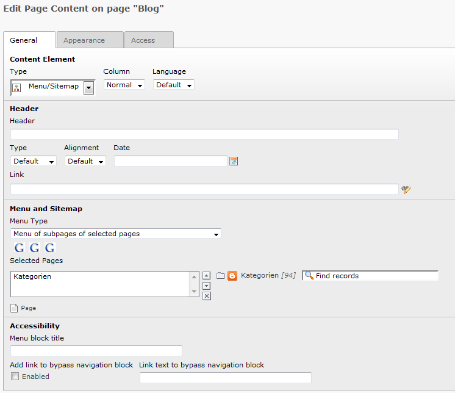

Create a rss feed only with typoscript.

Installation
------------

* Create a sysfolder
* Create a new template on the sysfolder
* Paste setup.txt as setup
* Paste constants.txt as constants and change the values as you like
* Create inside the sysfolder a page
* Create on the page a ext template
* Paste feedsettings.txt in constants of the ext template
* Create a sitemap element on the page like the picture below
* Set the pageuid und contentuid in the ext template constants

The sitemap element
-------------------

Demo
----
[http://anwendungsentwickler.ws/rssfeeds/blog.html](http://anwendungsentwickler.ws/rssfeeds/blog.html)
